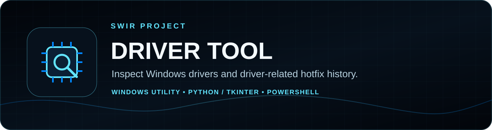

<!-- SWIR-README-STANDARD:v2 -->

<div align="center">



# Driver Tool

**Inspect installed Windows driver metadata and recent driver-related hotfix history from a compact Tkinter interface.**


[](https://github.com/Swir)
[](https://github.com/Swir/Driver-tool/releases/tag/v1.0.0)
[](https://github.com/Swir/Driver-tool/stargazers)

[**Highlights**](#-highlights) · [**Quick Start**](#-quick-start) · [**What the checks mean**](#-what-the-checks-mean) · [**Releases**](#-releases)

</div>

<p align="center"></p>

**Product roadmap progress:** N/A — there is no canonical measurable roadmap in this repository, so documentation does not invent a completion percentage.

## 📍 Project Status

| Item | Current state |
|---|---|
| Project type | Experimental Windows diagnostics utility |
| Platform | Windows with Windows PowerShell/WMI access |
| Latest public release | [`v1.0.0`](https://github.com/Swir/Driver-tool/releases/tag/v1.0.0), published September 12, 2026 |
| Driver mutation | **Not implemented** — the Update Drivers action is a simulation |
| Product roadmap | Not present; completion percentage is N/A |

<p align="center"></p>

## 🚀 Overview

**Driver Tool** is a small Tkinter desktop application that launches Windows PowerShell commands to display installed Plug-and-Play signed-driver names/versions and one recent installed hotfix whose description contains the word `driver`.

The utility is intended for inspection and troubleshooting. It is **not** a replacement for Windows Update, Device Manager or hardware-vendor driver tools, and its current source does not install, replace, roll back or remove drivers.

## ✨ Highlights

| Feature | What it actually does |
|---|---|
| 🧩 Driver inventory | Runs `Get-WmiObject Win32_PnPSignedDriver` and displays `DeviceName` plus `DriverVersion`. |
| 🪟 Hotfix history | Uses `Get-HotFix` and shows the newest installed hotfix whose description contains `driver`, when such output exists. |
| 🖥️ Tkinter GUI | Presents command output in a scrollable desktop text area. |
| 🧪 Update simulation | Enables an **Update Drivers** button in some result paths, but that action only prints a simulation message. |
| 📦 Windows package | Existing v1.0.0 release includes an EXE, portable ZIP and SHA-256 sidecar for the ZIP. |

## ⚙️ Quick Start

### Recommended — existing Windows release

Download the existing [`v1.0.0` release](https://github.com/Swir/Driver-tool/releases/tag/v1.0.0). It contains `Driver-Tool.exe`, `Driver-Tool-v1.0.0-Windows-x64.zip` and a ZIP checksum file.

This documentation migration did not rebuild or runtime-test the published binary.

### From source

Requirements are Python 3 with Tkinter plus Windows PowerShell with access to the WMI and hotfix commands used by the script.

```powershell
git clone https://github.com/Swir/Driver-tool.git
cd Driver-tool
python -m tkinter
python main.py
```

No third-party Python dependency is imported by the current `main.py`.

## 🔎 What the checks mean

The labels in the current GUI are more ambitious than the underlying data source, so interpret them carefully:

- **Installed Drivers** is a real inventory derived from `Win32_PnPSignedDriver`.
- **Available Update** is **not a live query for an available driver package**. The current code searches installed Windows hotfix history with `Get-HotFix` and filters descriptions containing `driver`.
- The current branch may enable the **Update Drivers** button when that text output does not contain a particular message. This does not prove an update exists.
- **Update Drivers** executes only `Write-Host "Simulating driver update..."` and then prints a success line in the app. It performs no driver installation.

For actual updates, use Windows Update, Device Manager or the device manufacturer's official support channel.

## 📋 Requirements / Compatibility

- Windows desktop environment.
- Python 3 with Tkinter when running from source.
- `powershell` command available on PATH.
- Access to `Get-WmiObject Win32_PnPSignedDriver` and `Get-HotFix` in the selected PowerShell environment.
- The packaging workflow builds on Windows with Python 3.11; this does not establish compatibility with every Windows/Python combination.

## 🧠 Technology / Project Layout

| Path | Role |
|---|---|
| [`main.py`](main.py) | Tkinter GUI plus PowerShell subprocess calls. |
| [`.github/workflows/release.yml`](.github/workflows/release.yml) | Existing Windows PyInstaller packaging/release workflow. |
| [`assets/readme/`](assets/readme/) | SWIR README PRO v2 branding and Progress SVG PRO assets. |
| [`tools/generate_readme_progress.py`](tools/generate_readme_progress.py) | Deterministically regenerates/checks the N/A progress graphics. |

The release workflow does not run on pull requests. A docs-only PR therefore cannot be described as having passed release CI unless a separate check actually ran.

## 📦 Releases

- [**Driver Tool v1.0.0 →**](https://github.com/Swir/Driver-tool/releases/tag/v1.0.0)
- [**All releases →**](https://github.com/Swir/Driver-tool/releases)

No release, tag, application version or executable was changed by this documentation migration.

## ⚠️ Limitations / Safety

- The application does not perform a true online driver-update search.
- The driver-update button is simulation-only despite the success wording shown afterward.
- PowerShell/WMI failures are surfaced as text for `CalledProcessError`; other environment failures may still interrupt the application.
- Driver changes can affect system stability. This project currently avoids performing them; use official update/recovery paths for real changes.
- No `LICENSE` file is present in the current repository; this migration does not assign a license.

## 🔎 Search Keywords

`windows driver viewer` • `windows driver inventory` • `python driver checker` • `powershell driver gui` • `installed drivers windows` • `PnP signed driver viewer` • `WMI driver utility` • `windows hotfix viewer` • `tkinter windows utility` • `driver version checker` • `windows hardware diagnostics` • `Driver Tool by Swir`

---

<div align="center">


### `INSPECT • VERIFY • TROUBLESHOOT`

**Driver Tool — by Swir**

[**← SWIR profile**](https://github.com/Swir) · [**All projects →**](https://github.com/Swir?tab=repositories) · [**Report an issue**](https://github.com/Swir/Driver-tool/issues)

</div>
